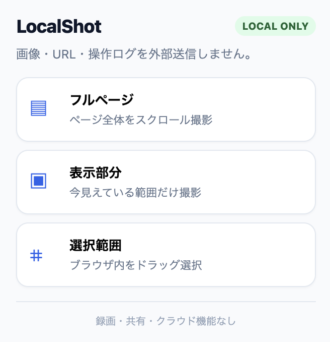
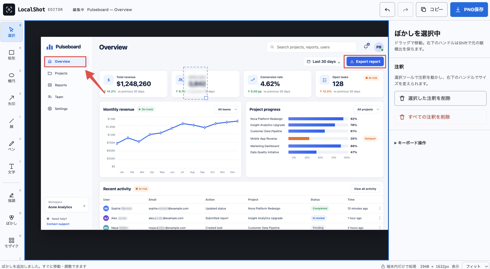

# LocalShot

完全ローカルで動作する、社内利用向け Chrome スクリーンショット・注釈拡張です。

## できること

- フルページ撮影（scroll & stitch）
- 表示部分撮影
- ブラウザ表示領域内の選択範囲撮影
- 矩形、楕円、線、矢印、フリーハンド
- テキスト
- ハイライト
- ぼかし / モザイク
- クロップ
- 注釈の選択、移動、右下ハンドルでリサイズ
- Undo / Redo
- PNGローカル保存
- 画像としてクリップボードへコピー
- キーボードショートカット

## デモ

架空のSaaSダッシュボードを撮影し、編集画面で注釈を加えた例です。



撮影後は、矩形・矢印・ぼかしなどを使って画面上のポイントを分かりやすく示せます。



## やらないこと

- 録画
- クラウド保存
- 共有URL
- アカウント / ログイン
- 外部API通信
- テレメトリ / アナリティクス
- 外部フォント、CDN、リモートJavaScript
- `<all_urls>` ホスト権限
- debugger 権限

Manifest の CSP でも `connect-src 'none'` に固定しています。また `npm run audit` で、ランタイムファイル中の代表的なネットワークAPIとリモートURLを検査します。

## インストール

1. このリポジトリをローカルに置く
2. Chrome で `chrome://extensions` を開く
3. 「デベロッパーモード」をON
4. 「パッケージ化されていない拡張機能を読み込む」
5. このリポジトリのルートフォルダを選択

ビルドは不要です。

## 使い方

拡張アイコンから以下を選びます。

- フルページ
- 表示部分
- 選択範囲

撮影後は LocalShot Editor が新しいタブで開きます。編集後に「PNG保存」または「コピー」を使用します。

### ショートカット

- `Alt+Shift+V`: 表示部分
- `Alt+Shift+F`: フルページ
- `Alt+Shift+S`: 選択範囲

Chrome側で競合する場合は `chrome://extensions/shortcuts` から変更してください。

## セキュリティ設計

要求権限は以下だけです。

- `activeTab`: ユーザーが起動した現在タブへの一時アクセス
- `scripting`: 範囲選択・スクロール制御などをオンデマンド注入
- `storage` + `unlimitedStorage`: 長いスクリーンショットを編集タブへ渡すためのローカル一時保存
- `downloads`: PNG保存
- `clipboardWrite`: 画像コピー

ホスト権限は宣言していません。

## フルページ撮影の仕組み

1. ページまたは主要な内部スクロールコンテナを計測
2. ページ先頭を撮影
3. 2枚目以降は fixed / sticky 要素を一時非表示
4. Chromeの撮影レート制限に配慮して順番にスクロール・撮影
5. Canvasでタイルを結合
6. DOM状態とスクロール位置を復元

内部スクロールコンテナ（SPAの中央ペイン等）も、主要なものをヒューリスティックに検出します。

## 既知の制限

- `chrome://` 等の保護ページは撮影不可
- 極端に長いページ（Canvasの安全上限を超えるもの）は1枚へ結合しない
- Lazy Loadが非常に遅いサイトでは画像読み込みが間に合わない場合がある
- 複数の独立したスクロールペインを同時に「ページ全体」として撮影することはしない
- クロップは画像サイズを変更するため、クロップ直前状態のみ特別にUndo可能

## 開発チェック

```bash
npm run check
```

ネットワーク監査だけなら:

```bash
npm run audit
```

## OSS調査

設計判断と参考プロジェクトは [RESEARCH.md](./RESEARCH.md) を参照してください。
